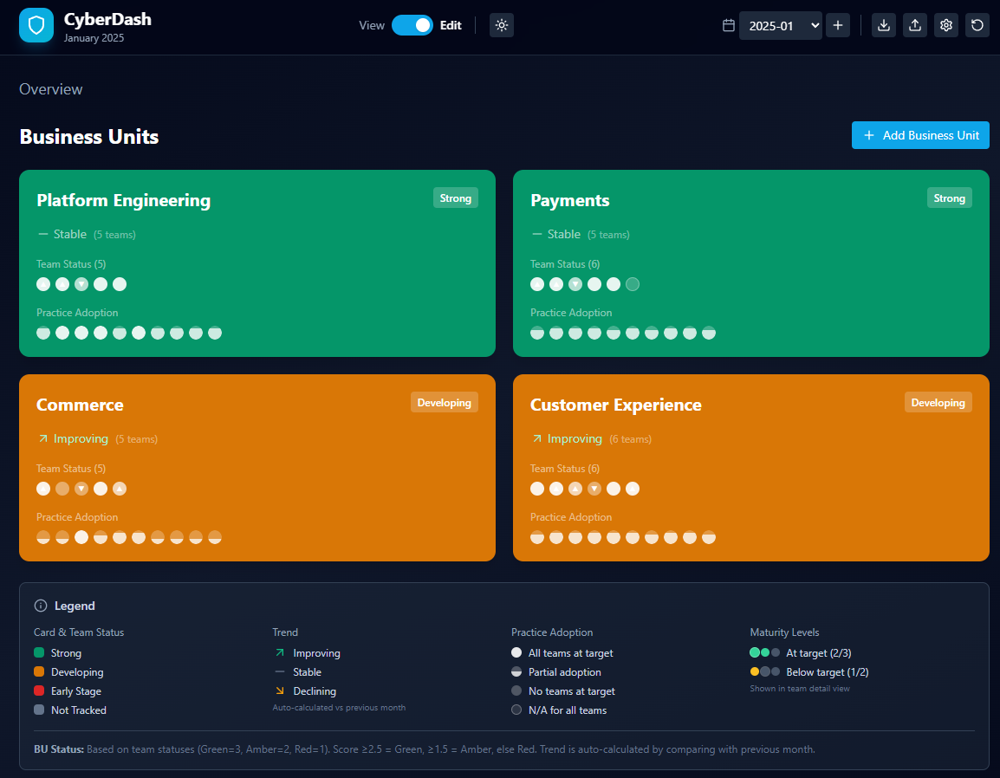

# CyberDash

A browser-based security practices dashboard for tracking security maturity across business units and teams. All data is stored in localStorage - no server required.



## Quick Start

```bash
npm install
npm run dev
```

Open http://localhost:5173 in your browser.

## Features

### Dashboard
- **Business Unit Overview** - Visual cards showing team status and practice adoption
- **Team Cards** - RAG status pills with hover tooltips showing details
- **Practice Adoption** - Pills showing full/partial/none adoption across teams
- **Light/Dark Mode** - Toggle between themes

### Teams
- **Configurable Types** - Support for Squads, Tribes, or custom team types
- **RAG Status** - Green/Amber/Red status with customizable labels and colors
- **Tracking** - Mark teams as tracked/untracked (untracked = grey, excluded from BU status)
- **Weighting** - Assign relative importance (0.1-1) for weighted calculations

### Practices
- **Two Types** - Boolean (Yes/No) or Maturity (0-4 scale)
- **N/A Support** - Mark practices as not applicable per team
- **Targets** - Set target levels for each practice
- **Key Practices** - Star important practices to highlight in tooltips
- **Custom Colors** - Assign colors for visual identification
- **Descriptions** - Add detailed descriptions shown on hover

### Maturity Scale
- **Customizable Levels** - Edit labels (None, Initial, Developing, Defined, Managed)
- **Descriptions** - Add explanations for each maturity level
- **N/A Option** - Level -1 for practices not applicable to a team

### Data Management
- **Auto-save** - All changes saved to localStorage automatically
- **Month Management** - Create new reporting periods, switch between them
- **Export/Import** - Download data as JSON, restore from backup
- **Settings Export** - Export just practices, scale, and colors separately
- **Factory Reset** - Start fresh with default settings

### View/Edit Modes
- **View Mode** - Read-only dashboard for presentations
- **Edit Mode** - Full editing capabilities with add/delete controls

## How to Use

### Initial Setup
1. Open the app and switch to **Edit** mode
2. Go to **Settings** to customize practices, maturity scale, and colors
3. Add your first Business Unit
4. Add Squads or Tribes within the Business Unit

### Monthly Workflow
1. Click **+** next to month selector to create a new reporting period
2. New month copies team structure, clears update summaries
3. Click into each team to update practice scores and monthly notes
4. Use **Reset** button to restore from previous period if needed

### Editing Teams
- **Practices**: Toggle for Yes/No, click maturity buttons for levels
- **N/A**: Click N/A button to mark practice as not applicable
- **Monthly Update**: Add summary of this period and plans for next
- **Trend**: Set to Improving, Stable, or Needs Attention

## File Structure

```
src/
  App.jsx           # Main application component
  main.jsx          # React entry point
  index.css         # Tailwind CSS styles
  store/
    useStore.js     # State management with localStorage
  components/
    Editable.jsx    # Inline editing components
```

## Tech Stack

- React 18 + Vite
- Tailwind CSS
- localStorage for persistence
- No backend required

## License

MIT
